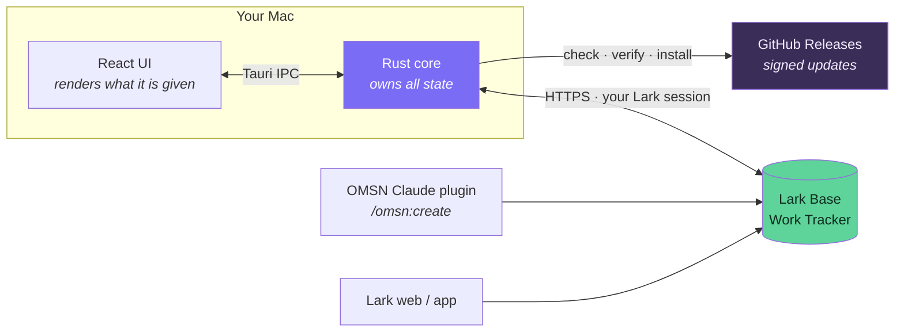
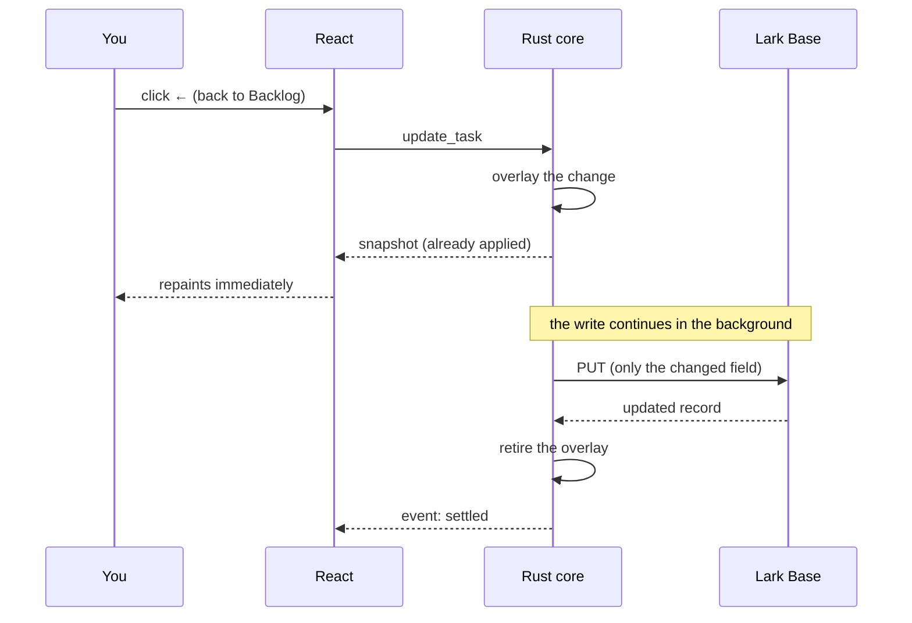
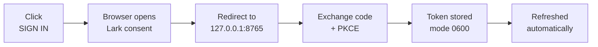
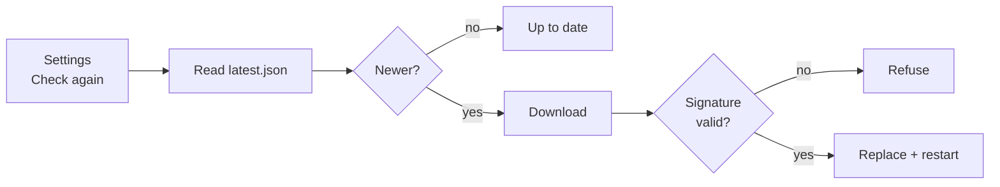

# How OMSN Desktop works

## The one thing that shapes everything

The app is **not the only writer** to the tracker. The OMSN Claude plugin
(`/omsn:create`, `/omsn:update`) writes to the same Lark Base table, and people
edit rows in Lark directly. Almost every design decision below follows from
that: writes carry only changed fields, a sent write is held until the server
confirms it, and a poll that started earlier can never overwrite newer data.

## Why the Rust core holds the state

The UI keeps no cache of its own. Everything it shows comes from one snapshot
the core owns.

**Personal-first is enforced here, not in the UI.** The core filters to the
signed-in person *before* serialising, so other people's rows never cross into
the webview. There is deliberately no "list all tasks" command — filtering in
React would mean the whole team's data had already arrived in the browser
context, where any UI bug or injected script could reach it.

The overlay is what makes a click feel instant without lying. If the write is
**rejected**, the row snaps back *and* says why — the command has already
returned by then, so the failure travels back in the next snapshot rather than
as a rejected promise.

## Reading

A refresh asks Lark for only the rows you own (`records/search` filtered on
`Owner`), which is roughly five times faster than walking the table. At sign-in
the core cross-checks that filtered result against one full walk; **any**
disagreement and it falls back to full walks for the session. Losing the
speed-up is acceptable, losing a task is not.

Two rules keep the data honest:

- **No network I/O while the store lock is held.** A poll clones what it needs,
  releases the lock, fetches, then re-takes it briefly. Holding it across a
  fetch made clicks queue behind a multi-second read.
- **A poll that began before the data currently held is discarded.** Without
  that, a slow poll returning late would overwrite a newer write.

## Signing in

The redirect listener binds **both** loopback families. `localhost` resolves to
`127.0.0.1` and `::1`, and a browser preferring IPv6 against an IPv4-only
listener meant the code was never delivered — sign-in simply timed out with no
explanation.

PKCE is sent, but Lark still requires the client secret, so the app is a
confidential client. The secret is read from `~/.config/omsn/desktop.env` and
is **not** compiled into the binary; a test keeps it that way.

## Updating

Every release is signed with a Minisign key; the matching public key is
compiled into the app, so a bundle that does not verify is refused. That
matters because GitHub releases are writable by anyone with repo access — the
signature, not the hosting, is what makes an update trustworthy.

## Where the code lives

| Path | Holds |
|---|---|
| `src-tauri/src/sync.rs` | The snapshot and the pending-write overlay. No I/O. |
| `src-tauri/src/store_cell/` | Locking. Enforces "no I/O while the lock is held". |
| `src-tauri/src/lark.rs` | Bitable transport, token refresh, the owner filter. |
| `src-tauri/src/oauth.rs` | Loopback consent flow. |
| `src-tauri/src/commands.rs` | The only place tasks cross into the webview. |
| `src-tauri/src/task.rs` | Field names and select values, verified against the Base. |
| `src/` | React UI. Renders; decides nothing about access. |
| `probe/` | Python oracle for the Lark contract — useful when the Rust client misbehaves. |

`docs/STATUS.md` records what was learned the hard way. Read it before changing
anything non-obvious.
